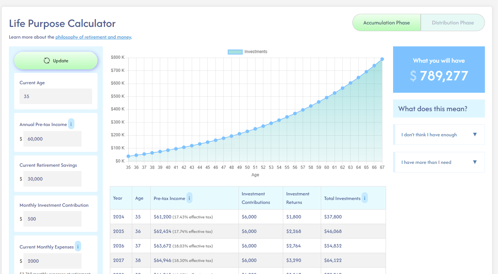

# Life Purpose Calculator

This is a small little project I made while looking through some retirement calculators online. The sites I visited always seemed to be missing some things I was interested in, so I just made a simple calculator.

The inspiration for creating this was a combination of reading financial books such as Die with Zero by Bill Perkins, and just thinking about the concept of retirement and savings. Not sure if this little webpage will help anyone, but thought I would throw it on the internet.

## Some of the features 
- Estimated living expenses at retirement - I always find this hard to quickly get to
- Breaking apart the phase where you are accumulating wealth, and where you are spending and enjoying your money
- A lot of normal fields and inputs that exist on most retirement calculators such as inflation rates, contributions, planned retirement age
- Simplified Social security calculations to see how much you will be making at retirement
- Effective tax rate calculation based off your pre-tax income
- Some things to ponder. I need to spend more time developing this area

## Building and running locally
This is just a simple HTML, javascript, and CSS project. No web servers. No NPM. just open the index.html page in a web browser and everything should work.

## Todo
- Need to spend more time to see if my calculations can be improved, or be more accurate.
- Make this work on a mobile phone or smaller devices. The layout starts breaking at about 1300 pixels right now